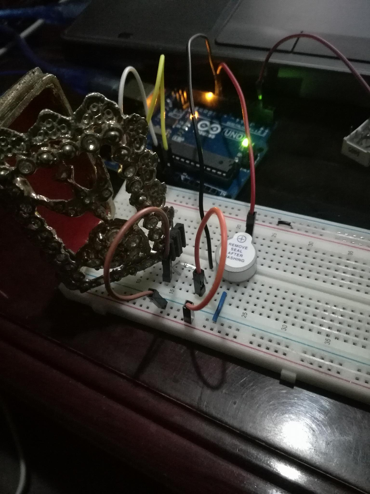
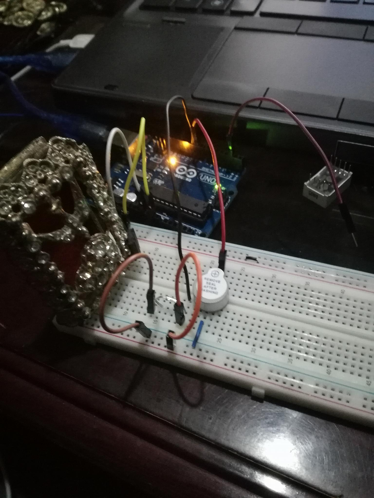
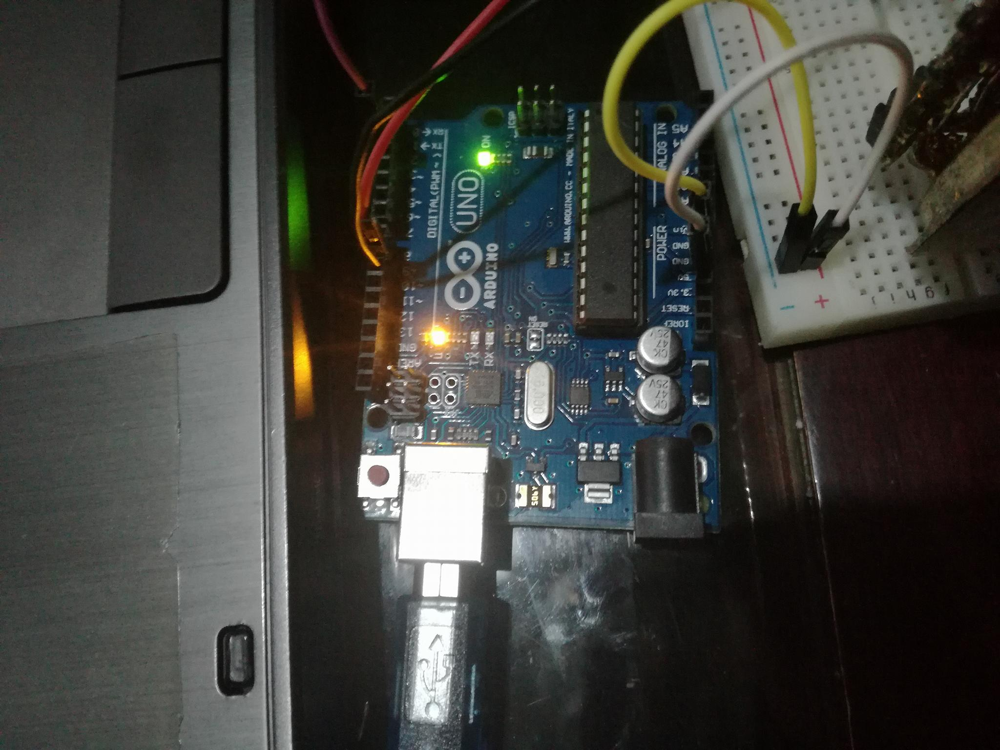

# Puerta_con_alarma
proyecto de arduino para la alarma de una puerta

#Indice
* Objetico
* Descripcion
* Materiales
* Dragrama
* Evidencias
* Codigo
* Conclusion

#Objetivo
>Desarrollar un programa que activa una alarma de una puerta

#Descripcion
>Se aplicaran conocimientos previos obtenidos en clase para la elaboracion y funcionamiento de una alarma
>que se activara cuando una puerta sea abierta, esta alarma emitira un sonido con duracion de dos segundos
>(que durara dos segundos tiempo que use por motivos practicos) y este sonido lo emitira un buzzer y este 
>proceso lo activara un iman al hacercarse al reed switch.

#Materiales
*  Protoboard
*  Arduino Uno
*  Cables calibre 22
*  buzzer
* 1 reed switch
* Laptop o PC de escritorio
* Software IDE Arduino
* iman

#Diagrama

#Evidencias

#Codigo

    #include "LowPower.h"           //es la libreria que se encarga de que el arduino pueda entrar a un modo de ahorro de energia

    int zumbador = 9;                //se declara en que pin va ser de la bocina 
      
    const int puerta=10;               //se declara el pin que va recivir  el estado de la puerta
        

    void setup(){                     //inicia el metodo setup que se encarga de indicar el estado de cada puerto 
    pinMode(puerta,INPUT_PULLUP);   //se indica que el pin de la puerta va a emitir la señal hacia el arduino
 
                                   //para saber si la puerta esta abierta o cerrada
                                   
    pinMode(zumbador,OUTPUT);      //se indica que el pin de la bocina va recivir la señal del arduino
  
    }                                 //termino del metodo setup

    void loop(){                                            //inicio del metodo loop que es el que se encarga de la funcionalida                                             

    LowPower.powerDown(SLEEP_8S, ADC_OFF, BOD_OFF);  // este es el modo de ahorro de energia en el cual como lo dice su primer

                                                      //parametro dura 8 segundos en esta fase en el cual se apagan los
                                                     
                                                      //comvertidores de analofico a digital
   
    int value = digitalRead(puerta);`
   
    if(value == LOW){                                 //este if indica que cuado la pueta este cerrada no va ha hacer nada pero
   
                                                     `//cuando este abierta se va a activar la alarma

    digitalWrite(zumbador,HIGH);                        //se activa el pitido de la alarma con la frecuencia establecida anteriormente      delay(2000);                                  //indica que el tiempo que durara el pitido en este ejemplo es de 2 segundos`
                                                         
      }                                                 //indica el temino del if que se encarga de la alarma 
     
      digitalWrite(zumbador,LOW);                        //indica que la bocina y va dejar de emitir el pitido
    }

#Conclusion
>Me percate que todo ese proceso de una alarma en una puerta no tiene gran transfondo como me imagine,
>todo es muy sencllo cuando conoces coo hacerlo y gracias a este tipo de practicas que nos ayudan a comprender
>como funcionan las cosas que nos rodean en el dia a dia y conocer su funcionamiento.
